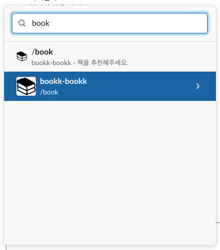
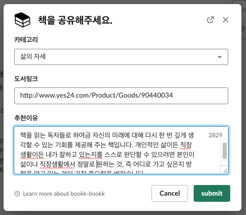
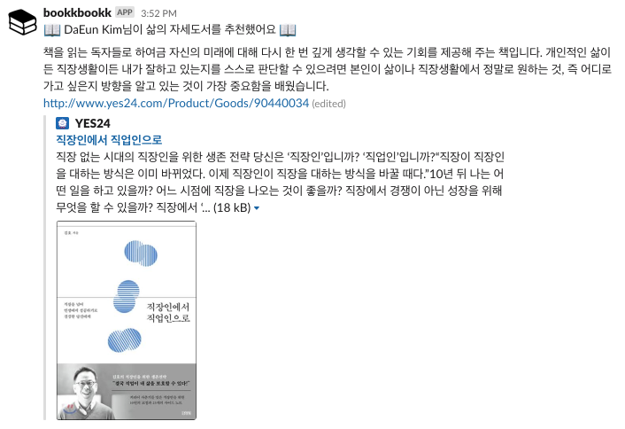
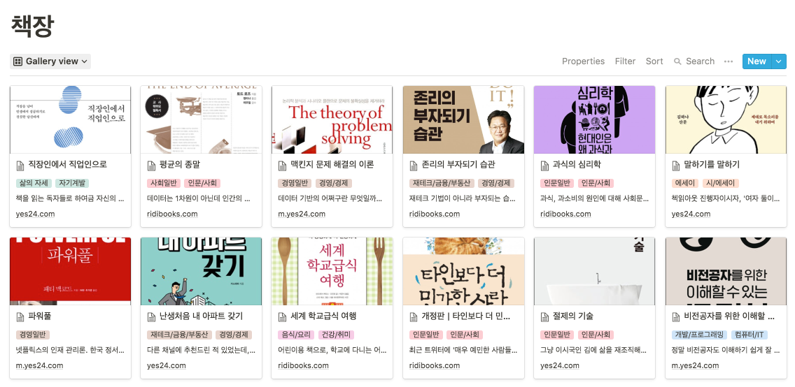
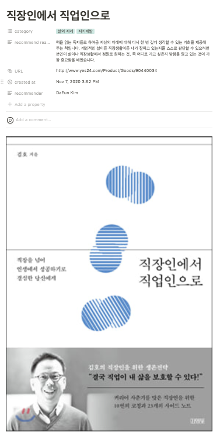

# bookk-bookk 

### 슬랙 무료플랜을 사용하는 북클럽을 위한 슬랙봇 '북크북크'

 

왜 만들었어요?

- 실바니안 북클럽은 슬랙 워크스페이스를 무료로 사용하기 때문에 `#books` 채널에서 회원들이 공유하는 책 정보들이 사라집니다.
- 회원님들의 소중한 추천도서들이 사라지는 것을 막기 위해 슬랙이 아닌 다른 곳에 아카이빙하는 게 필요해요.
- 최근에 노션에서 구독 정책을 바꾸면서 블럭을 무제한으로 풀었기 때문에 노션에 아카이빙하기로 했어요.

무슨 기능이 있어요?

- 도서 정보를 입력하면 북클럽 전용 노션에 저장해요.
    - 저장된 도서정보들을 Gallery View 로 조회 가능
    - 책 이름을 클릭하면 추천인을 포함한 상세정보 조회 가능
    - 템플릿에서 단어 검색 가능
- 매월 1일에 지난 달에 등록된 추천 도서들을 집계하고 책을 가장 많이 추천한 추천왕을 선정해요.

 

### 사용 가이드

1. `#books` 채널에서 `/book` 명령어를 입력하세요.  

2. 추천하려는 도서의 카테고리, 링크, 추천이유를 입력하세요.  

3. 북크북크가 채널에 결과 메세지를 전송합니다.  

4. 실바니안 노션에서 그동안 쌓인 추천 도서들을 볼 수 있어요.  

5. 추천한 도서의 상세 정보도 확인할 수 있어요.  

